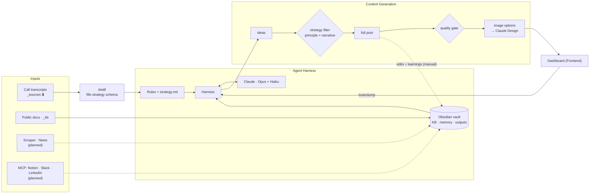

# Marketing Engine (Agnostic V2)

A multi-tenant, **brand-agnostic** AI marketing-content engine built on the
[Claude Agent SDK](https://code.claude.com/docs/en/agent-sdk/python). One engine
serves many clients; each client is described entirely by its own files in a
**vault** of Obsidian-style markdown + YAML. Change a client → edit vault files.
Change the engine → edit `src/`. Nothing about any client is hard-coded.

**Auth:** no API key. The engine drives the Claude Code CLI over your existing
Claude Code login.

---

## System diagram



Solid arrows are built; dotted arrows and `(planned)` boxes are next on the
roadmap. The `_sources` transcripts are read **only** by `distill` and are
firewalled from generation.

## How it works

```
braindump ─▶ ideas ─▶ [strategy filter] ─▶ pick one ─▶ full post ─▶ [quality gate] ─▶ image options ─▶ instructions
            (Haiku)     (Haiku)                          (Opus)        (Haiku)         (Haiku)
```

1. **Ideas** — brainstorm a few short-post ideas from the brand's voice + rules.
2. **Strategy filter** — a cheap Haiku pass keeps only the ideas that tie a
   **business principle** to a **customer narrative**; survivors carry their tags.
3. **Full post** — Opus writes the chosen idea, reading the brand's `_kb/` (and
   physically blocked from the firewalled `_sources/`).
4. **Quality gate** — Haiku checks one-idea / on-narrative / single-CTA, one retry.
5. **Images** — recommend an approach + 3 options (library / real photo /
   generated), pick one → Claude Design instructions for that choice.

### The agnostic seam
`content/strategy.py` defines **one** universal schema — `business_principles`,
`customer_personas`, `customer_narratives` — for **every** brand. `distill` fills
it from that brand's uploaded call transcripts; the filter reads it back by key.
The engine never names a brand. Today's client (Denario) is just one fill of the
template; upload another company's data and the same code fills the same sections
with their answers, no engine change.

## The vault

```
vault/
├── _shared/                      house style applied to every client
└── tenants/<account>/brands/<client>/
    ├── brand.yaml                identity, voice, narrative, model tiers
    ├── _rules/                   always-on brand rules (inlined into the prompt)
    │   └── strategy.md             AUTO: business principles · personas · narratives · ideas
    ├── _sources/   🔒            raw transcripts — FIREWALLED (only `distill` reads them)
    ├── _kb/                      public material the agent may read
    ├── _outputs/  _memory/       drafts + edit learnings (engine writes here)
    └── _design/tokens.yaml       brand colours/fonts
```

The vault is **gitignored** — it's client data and never leaves your machine.

## Repository layout

Folders mirror the systems diagram, one zone per box:

| Zone | Folder |
|---|---|
| Agent Harness (the brain) | `src/marketing_engine/harness/` |
| Content Generation | `src/marketing_engine/content/` (strategy, filter, distill, validate) |
| LLM seam (only place that imports Claude) | `src/marketing_engine/sdk/` |
| Obsidian Memory / KB (only place that touches files) | `src/marketing_engine/vault/` |
| Integrations + Scraper | `src/marketing_engine/inputs/` |
| Image Generation | `src/marketing_engine/image/` |
| Frontend (dashboard backend) | `src/marketing_engine/server/` + `web/` |

Two invariants keep it testable offline: **only `sdk/` imports Claude; only
`vault/` touches files.** See [ARCHITECTURE.md](ARCHITECTURE.md) for the full map.

## Setup

```bash
python3.12 -m venv .venv
source .venv/bin/activate
pip install -e ".[dev]"
```

Make sure `claude` is installed and you're logged in (`claude --version`).

## Usage

```bash
engine serve                                   # dashboard at http://127.0.0.1:8765/
engine run --tenant <acct> --brand <client>    # one-shot run (uses your Claude Code login)
engine run ... --dry-run                       # fake model, no network, no auth
pytest                                          # full offline test suite
```

### Onboarding a new client

```bash
engine new-brand -t <acct> -b <client>
engine ingest <transcripts...> -t <acct> -b <client> --sources   # -> _sources/ (firewalled)
engine ingest <public docs...> -t <acct> -b <client>             # -> _kb/
engine distill -t <acct> -b <client>                             # writes strategy.md + proof-points.md
# review the written files, edit brand.yaml, then generate
```

## Status

Built: the agnostic engine spine, the dashboard, transcript distillation + the
`_sources` firewall, the strategy filter, the quality gate, and the image-options
flow. Next: a coverage memory loop, scraper/news inputs, and MCP connectors.
